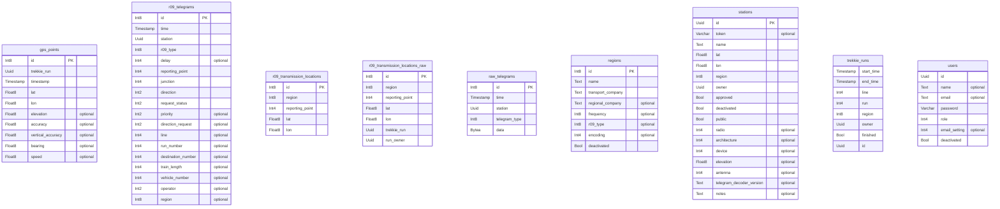

# TLMS Rust Crate

[](https://builtwithnix.org)

This crate contains all the reusable code for our vehicle tracking efforts. To
use, just drop it into your `Cargo.toml`.

## Building and Hacking

### With Nix (aka easy way)

This flake provides a devshell, which exposes all the dependencies
automatically. Just run `nix develop` anywhere in the repo.

### Without Nix

Just install the dependencies, build is done by cargo.

List of dependencies:
```
grpc
protobuf
websocketpp
pkg-config
postgresql_14
openssl
diesel-cli
```

## Documentation

Run `cargo doc --all-features --open` in a nix devshell, hosted version coming
soon-ish ;).

## Features 

List of rust features this crate exposes: `schema`, `management`, `locations`,
`telegrams`, `measurements`, `receivers`, `trekkie`, `gps`

## Entity Relationship diagram


